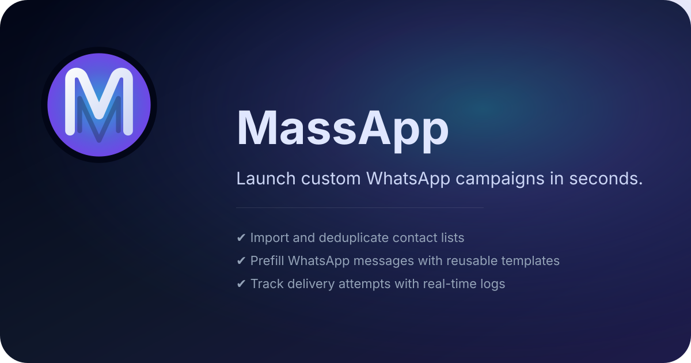

# MassApp - WhatsApp campaign launcher



[](package.json) [](vite.config.js) [](LICENSE)

MassApp is a Vite + React progressive web app that turns recipient lists into ready-to-send WhatsApp chats. Paste or type your numbers, compose the message once, and launch custom WhatsApp campaigns in seconds.

## 🚀 Features

- Recipient parser that normalises raw phone numbers or JIDs and removes duplicates
- Bulk link builder with a responsive preview grid and clipboard helpers
- Mode selector that swaps between WhatsApp Web, api.whatsapp.com, and link templates
- Optional BrowserOS companion workflow to automate send actions after MassApp opens chats
- Supabase-backed import pipeline with batching, deduplication, and contact health metrics
- Template manager and contact explorer modals to reuse copy and audit send history
- Installable Tailwind-powered interface delivered through `vite-plugin-pwa`

## ✅ Prerequisites

- Node.js 18+ (or Bun 1.1+)
- A browser where WhatsApp Web is already authenticated and pop-ups are allowed

## 🛠️ Getting Started

```bash
bun install         # or: npm install / pnpm install / yarn install
bun run dev         # start the Vite dev server on http://localhost:5174
```

To ship a production bundle:

```bash
bun run build
bun run preview     # optional: serve the production build locally
```

## 📋 Usage

1. Open the dev server URL (or the static build) in a browser where WhatsApp Web is logged in.
2. Enter one phone number per line. Numbers can include punctuation; they are cleaned automatically.
3. Compose the message body you want to send.
4. Choose the link mode you prefer and click **Open WhatsApp Tabs**.
5. Approve any pop-up prompts. Each tab loads WhatsApp with the selected number and prefilled message.

If your browser blocks the pop-up batch, use the preview list to open or copy links manually.

### 🤖 BrowserOS companion

MassApp stays in-browser, but you can hand off the final “press send” step to [BrowserOS](https://github.com/browseros-ai) for a supervised automation flow:

1. Launch your campaign in MassApp so WhatsApp tabs open with the composed message.
2. Switch to BrowserOS and make sure it can control the browser session where the tabs are open.
3. Provide the following prompt so BrowserOS clicks the send button on every tab:

```
For each WhatsApp Web tab that opens, perform the following actions in sequence:

Wait for the tab to fully load
Find and locate the send button on the current tab
Click the send button
Switch to the next WhatsApp Web tab
Repeat steps 2-4 until all WhatsApp Web tabs have been processed
```

Keep the run supervised: WhatsApp may still request additional confirmation when throttling kicks in.

## ⚙️ Configuration

1. Duplicate `.env.development` (and `.env.production` for builds) with your Supabase project credentials:

	```bash
	cp .env.development .env.local
	```

	| Variable | Description |
	| --- | --- |
	| `VITE_SUPABASE_URL` | Supabase project REST endpoint |
	| `VITE_SUPABASE_ANON_KEY` | Public anonymous key for client-side calls |
	| `SUPABASE_SERVICE_ROLE_KEY` | Service role key used by server utilities (keep private) |
	| `SUPABASE_DB_PASSWORD` | Local tooling helper for connecting to Postgres |

2. Apply the SQL in [supabase/schema.sql](supabase/schema.sql) to a fresh Supabase database (SQL Editor → “Run”).
3. Create an email/password user for the team inside Supabase Auth to log into the app.
4. Adjust icons or manifest branding in `public/` if you want a custom theme.

## 🗂️ Project Structure

```
.
├── public/            # Static assets served by Vite (icons, manifest)
├── src/
│   ├── App.jsx        # Tab launcher UI and logic
│   ├── index.css      # Tailwind base layer and theme overrides
│   └── main.jsx       # Entry point with PWA registration
├── index.html         # Vite HTML entry template
├── package.json       # Scripts and dependencies
├── tailwind.config.js # Tailwind configuration
├── vite.config.js     # Vite + PWA configuration
└── eslint.config.js   # Flat ESLint config
```

## 🚧 Limitations

- WhatsApp enforces rate limits and manual confirmation; unattended delivery is not supported.
- Browsers may block programmatic pop-ups. Allow pop-ups for the site or use the manual preview links.
- No scheduling or delivery telemetry is available—MassApp intentionally keeps the scope simple.

## 📄 License

Released under the [MIT License](LICENSE). See the license file for exact wording.

## 🧠 Acknowledgments

"Whoever loves discipline loves knowledge, but whoever hates correction is stupid."

