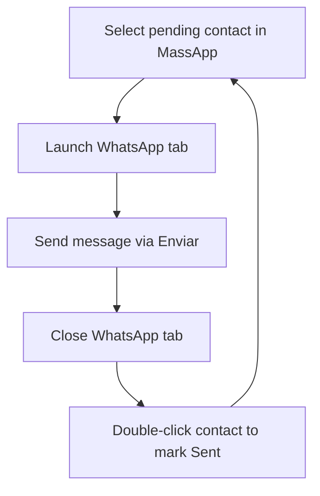

# MassApp - WhatsApp campaign launcher


[](package.json) [](vite.config.js) [](LICENSE)

MassApp is a Vite + React progressive web app that turns recipient lists into ready-to-send WhatsApp chats. Paste or type your numbers, compose the message once, and launch custom WhatsApp campaigns in seconds.

## 🚀 Features

- Recipient parser that normalises raw phone numbers or JIDs and removes duplicates
- Bulk link builder with a responsive preview grid and clipboard helpers
- Mode selector that swaps between WhatsApp Web, api.whatsapp.com, and link templates
- Optional BrowserOS companion workflow to automate send actions after MassApp opens chats
- Supabase-backed import pipeline with batching, deduplication, and contact health metrics
- Template manager and contact explorer modals to reuse copy and audit send history
- Installable Tailwind-powered interface delivered through `vite-plugin-pwa`

## ✅ Prerequisites

- Node.js 18+ (or Bun 1.1+)
- A browser where WhatsApp Web is already authenticated and pop-ups are allowed

## 🛠️ Getting Started

```bash
bun install         # or: npm install / pnpm install / yarn install
bun run dev         # start the Vite dev server on http://localhost:5174
```

To ship a production bundle:

```bash
bun run build
bun run preview     # optional: serve the production build locally
```

## 📋 Usage

1. Open the dev server URL (or the static build) in a browser where WhatsApp Web is logged in.
2. Enter one phone number per line. Numbers can include punctuation; they are cleaned automatically.
3. Compose the message body you want to send.
4. Choose the link mode you prefer and click **Open WhatsApp Tabs**.
5. Approve any pop-up prompts. Each tab loads WhatsApp with the selected number and prefilled message.

If your browser blocks the pop-up batch, use the preview list to open or copy links manually.

## 🚀 BrowserOS Workflow = Full Automation (Optional)

This streamlined workflow automates sending WhatsApp messages to pending contacts through MassApp and marking them as sent. The Bulk Tab Launcher input clears automatically when the contact status updates to SENT, so you never need a manual cleanup step.

#### Phase 1: Select Contact

1. Click once on a contact that shows **Pending** in the MassApp contacts panel.
2. MassApp highlights the row, drops the phone number into the **Recipients** field, and preloads the message.

#### Phase 2: Send in WhatsApp

3. Click **Open WhatsApp Tabs** to launch WhatsApp Web in a new browser tab with the prefilled conversation.
4. In WhatsApp Web, press the **Enviar** button so the message sends and clears from the input.

#### Phase 3: Close WhatsApp & Mark as Sent

5. Close the WhatsApp browser tab to return focus to MassApp.
6. Double-click the same contact row to flip its status to **Sent**. The Bulk Tab Launcher input clears instantly, the contact moves out of the **Pending** filter, and the next pending contact becomes visible.

##### Complete Workflow Summary

| Step | Action | Location | Result |
| --- | --- | --- | --- |
| 1 | Single-click pending contact | MassApp contacts panel | Contact selected, phone populates Recipients field |
| 2 | Click **Open WhatsApp Tabs** | MassApp launcher | WhatsApp tab opens with conversation ready |
| 3 | Click **Enviar** | WhatsApp Web | Message sends with delivery timestamp |
| 4 | Close WhatsApp tab | Browser tab bar | Focus returns to MassApp |
| 5 | Double-click contact | MassApp contacts panel | Status updates to Sent, input clears, contact leaves Pending |

##### Repeat Cycle

- Filtered view shows only pending contacts.
- Marking a contact as sent removes it from Pending, exposing the next contact.
- The Bulk Tab Launcher input clears automatically, so the five-step loop restarts immediately.

##### Key Points

- Single-click selects; double-click marks as sent.
- Always close the WhatsApp tab before jumping back to MassApp.
- Messages stay pre-populated—no retyping required.
- Automatic filtering and input cleanup keep the workflow continuous.

##### Troubleshooting

- WhatsApp tab blocked? Allow pop-ups in the browser.
- Contact not selected? Confirm the **Pending** filter is active.
- Status didn’t change? Double-click with a slight pause between taps.
- Message stuck? Make sure WhatsApp Web finished loading before sending.
- List stale? Refresh MassApp and reapply the **Pending** filter.
- Input didn’t clear? Refresh MassApp to resync the state.



## ⚙️ Configuration

1. Duplicate `.env.development` (and `.env.production` for builds) with your Supabase project credentials:

	```bash
	cp .env.development .env.local
	```

	| Variable | Description |
	| --- | --- |
	| `VITE_SUPABASE_URL` | Supabase project REST endpoint |
	| `VITE_SUPABASE_ANON_KEY` | Public anonymous key for client-side calls |
	| `SUPABASE_SERVICE_ROLE_KEY` | Service role key used by server utilities (keep private) |
	| `SUPABASE_DB_PASSWORD` | Local tooling helper for connecting to Postgres |

2. Apply the SQL in [supabase/schema.sql](supabase/schema.sql) to a fresh Supabase database (SQL Editor → “Run”).
3. Create an email/password user for the team inside Supabase Auth to log into the app.
4. Adjust icons or manifest branding in `public/` if you want a custom theme.

## 🗂️ Project Structure

```
.
├── public/            # Static assets served by Vite (icons, manifest)
├── src/
│   ├── App.jsx        # Tab launcher UI and logic
│   ├── index.css      # Tailwind base layer and theme overrides
│   └── main.jsx       # Entry point with PWA registration
├── index.html         # Vite HTML entry template
├── package.json       # Scripts and dependencies
├── tailwind.config.js # Tailwind configuration
├── vite.config.js     # Vite + PWA configuration
└── eslint.config.js   # Flat ESLint config
```

## 🚧 Limitations

- WhatsApp enforces rate limits and manual confirmation; unattended delivery is not supported.
- Browsers may block programmatic pop-ups. Allow pop-ups for the site or use the manual preview links.
- No scheduling or delivery telemetry is available—MassApp intentionally keeps the scope simple.

## 📄 License

Released under the [MIT License](LICENSE). See the license file for exact wording.

## 🧠 Acknowledgments

"Whoever loves discipline loves knowledge, but whoever hates correction is stupid."

